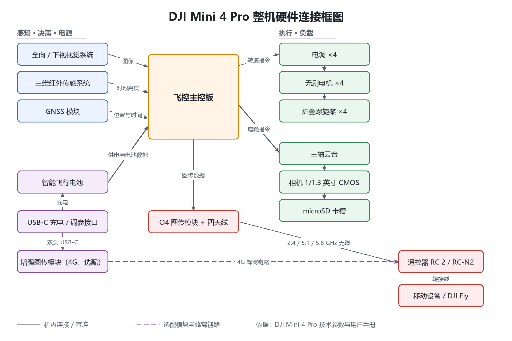

# 无人机硬件组成报告

> - **示例机型**：DJI Mini 4 Pro
> - **作者**：金泽宇（学号 3250104390）
> - **用途**：无协纳新 bonus 1.5.3（Git 版本控制）
> - **当前版本**：v3.0 修订版 · 2026-10-05

---

## 0 关于本报告

本报告以消费级折叠四旋翼 **DJI Mini 4 Pro** 为例，梳理一台小型多旋翼无人机的硬件组成，
说明每个分系统由哪些部件构成、各自承担什么功能、彼此之间怎样连接。

报告选择这款机型的理由：它是一台高度集成、公开参数完整的量产机，
在 249 克以内的起飞重量里同时容纳了飞控、全向避障、三轴云台相机和高清图传，
适合用来观察"一台无人机到底由哪些硬件组成"这个问题。

本文档会随着后续修改持续演进，每次修改的内容记录在文末的修订记录中。

---

## 1 总体架构：四个功能层加两条支撑链路

从功能上，可以把这台无人机的硬件归入四层，另外有两条链路贯穿其中：

| 层级 | 承担的硬件 | 在 Mini 4 Pro 上的体现 |
| --- | --- | --- |
| 感知层 | 相机、视觉传感器、红外传感器、IMU、GNSS 模块 | 全向双目视觉系统 + 底部三维红外传感器 + GPS/Galileo/BeiDou；IMU 属飞控内部器件，官方未单列参数 |
| 决策层 | 机载计算与飞控固件 | 一体化的飞控主板，负责定位、避障与飞行决策 |
| 控制层 | 姿态与位置控制算法、电机驱动 | 飞控输出的控制量经驱动电路作用到四个电机 |
| 执行层 | 无刷电机、螺旋桨 | 四个无刷电机带动折叠桨，产生升力与姿态力矩 |
| 供电链路 | 智能飞行电池、充电管家、分电与电源管理 | Li-ion 智能电池 + BMS，电源分配到主控与动力 |
| 通信链路 | 图传模块、遥控器、天线 | O4 图传，2.4 / 5.1 / 5.8 GHz，机身四天线（二发四收） |

后文的六个分系统（第 3 节）就按这个架构依次展开。

---

## 2 整机定位与主要边界参数

- 起飞重量：低于 249 克（含智能飞行电池、桨叶与 microSD 卡）
- 折叠尺寸：148 × 94 × 64 毫米（不带桨）；展开尺寸含桨叶为 298 × 373 × 101 毫米
- 最大上升/下降速度：5 米/秒；最大水平飞行速度：16 米/秒（运动挡）
- 最长飞行时间：34 分钟（智能飞行电池）/ 45 分钟（长续航智能飞行电池）
- 最大抗风速度：10.7 米/秒（5 级风）；最大可倾斜角度 35°
- 工作环境温度：-10℃ 至 40℃
- 最大起飞海拔高度：4000 米（标准智能飞行电池）
- 欧盟分类：C0

---

## 3 硬件分系统概览

### 3.1 飞控与感知系统

飞控是整机的决策核心，负责姿态解算、位置估计、避障判断与飞行控制。
Mini 4 Pro 的定位与姿态信息来源有两类：一类是 GNSS（GPS + Galileo + BeiDou），
另一类是机身感知系统，二者互相补充。

感知系统为**全向双目视觉系统，辅以机身底部三维红外传感器**，这是 Mini 系列首次实现全向主动避障：

| 方向 | 测距范围 | 有效避障速度 | 视角（FOV） |
| --- | --- | --- | --- |
| 前视 | 0.5 – 18 米 | ≤ 12 米/秒 | 水平 90°，垂直 72° |
| 后视 | 0.5 – 15 米 | ≤ 12 米/秒 | 水平 90°，垂直 72° |
| 侧视 | 0.5 – 12 米 | ≤ 12 米/秒 | 水平 90°，垂直 72° |
| 上视 | 0.5 – 15 米 | ≤ 5 米/秒 | 前后 72°，左右 90° |
| 下视 | 0.3 – 12 米 | ≤ 5 米/秒 | 前后 106°，左右 90° |

底部三维红外测距传感器测距范围为 0.1 – 8 米（反射率 > 10%），
视角前后 60°、左右 60°，主要用于低空悬停与降落阶段的高度测量。

需要注意表里的"测距范围"和"可探测范围"不是一回事：前者是避障真正起作用、
能触发刹停的距离，后者是传感器能看到目标的距离。官方对前视另外给出可探测范围 0.5 – 200 米，
数量级完全不同，引用时不能混用。

悬停精度（无风或微风环境）：视觉定位正常工作时垂直与水平均为 ±0.1 米，仅靠 GNSS 时为 ±0.5 米。

### 3.2 动力系统

动力系统由**四个无刷电机**、**四片可折叠螺旋桨**和机身内部的**电调**组成，采用四旋翼布局，
通过对角桨的反向旋转抵消反扭矩，靠四个电机的转速差产生姿态与位置变化。

这一版专门核对了这三个部件的型号情况，结论是官方并没有把参数公开到部件级：

- **电机**：无刷电机，官方技术参数页与用户手册都没有给出型号、KV 值或尺寸，用户手册的机身部件图把"电机"列为独立部件。
- **螺旋桨**：可折叠桨。DJI 官方商城的配件上架名称为「DJI Mini 4 Pro/Mini 3 Pro 螺旋桨」，说明这两代机型共用同款桨叶；桨叶的直径与螺距官方同样未公布。
- **电调**：用户手册确认机身内部存在电调——开机自检后电调会发出提示音，并且支持在 App 中手动启动/停止电机；但型号与参数未公开。用户手册列出的机身外部部件共 14 项，其中没有独立的电调模块，因此这四路电机驱动应集成在机身内部的主控板上。需要说明的是，这一条是依据官方部件清单做出的推断，不是官方明确表述。

与动力相关的整机指标：最大水平飞行速度 16 米/秒（运动挡）、
最大上升与下降速度 5 米/秒、最大抗风速度 10.7 米/秒、最大可倾斜角度 35°。
折叠桨让机身能在收纳时收拢到 148 × 94 × 64 毫米。用户手册还提示高海拔环境下电池与动力性能会下降：
标准智能飞行电池的最大起飞海拔为 4000 米，长续航电池为 3000 米，
若再装上桨叶保护罩则降到 1500 米。

### 3.3 电源系统

电源系统由**智能飞行电池**、电池管理系统和**双向充电管家**构成。
电池为 Li-ion 类型，可换用两种容量：

| 项目 | 智能飞行电池 | 长续航智能飞行电池 |
| --- | --- | --- |
| 容量 | 2590 毫安时 | 3850 毫安时 |
| 重量 | 约 77.9 克 | 约 121 克 |
| 标称电压 | 7.32 伏 | 7.38 伏 |
| 能量 | 18.96 瓦时 | 28.4 瓦时 |
| 最长飞行时间 | 34 分钟 | 45 分钟 |
| 最长悬停时间 | 30 分钟 | 39 分钟 |

充电采用 USB PD 快充，推荐 30 瓦 USB-C 充电器，既可经机身充电，
也可用双向充电管家为三块电池轮充——官方原文是"3 块电池轮充"，指的是依次充电而不是同时充电；
机身充电 70 分钟、管家充电 58 分钟，均指标准智能飞行电池。
需要注意的是，换用长续航电池后整机重量会超过 249 克，且官方提示此时不应再挂载桨叶保护罩等额外负载。

### 3.4 通信与图传

通信链路负责把遥控指令送上天空、把实时画面传回地面，由机身图传模块、天线和遥控器构成。
Mini 4 Pro 使用 **DJI O4 图传方案**：

- 机身天线：四天线，二发四收
- 工作频段：2.4000 – 2.4835 GHz、5.170 – 5.250 GHz、5.725 – 5.850 GHz
- 实时图传画质：遥控器最高 1080p/60fps
- 最低延时：飞行器与遥控器之间约 120 毫秒
- 最大信号有效距离：FCC 标准 20 公里，SRRC/CE/MIC 标准 10 公里；实际距离随干扰与遮挡显著下降
- 最大下载速率：O4 图传 10 MB/s；Wi-Fi 5 下可达 30 MB/s（该数据要求素材存储于机身内置存储，且在低干扰环境下测得）

遥控器一侧的硬件按版本不同：DJI RC 2 带屏遥控器内置 5.5 英寸 1920 × 1080 触摸屏、
GPS/Galileo/BeiDou 三模定位模块、蓝牙与 Wi-Fi 联网能力、32 GB 机身存储（可用 microSD 扩展）
以及可拆卸摇杆，电池容量 6200 毫安时 / 22.32 瓦时，最长工作时间约 3 小时；
RC-N2 版本没有屏幕，用转接线（Lightning / USB-C / Micro-USB）连接移动设备，
其电池容量 18.72 瓦时（3.6 伏、2600 毫安时 × 2），未给移动设备充电时最长续航 6 小时。

除了 O4 直连链路，这台飞机还有两条辅助无线链路：

- **手机快传**：飞行器通过 Wi-Fi 直接连接移动设备，不接遥控器也能把照片视频下载到手机，最高 30 MB/s；使用前需要打开移动设备的蓝牙与 Wi-Fi，其中蓝牙用于让 DJI Fly 发现飞行器。
- **增强图传（4G）**：选配 DJI 增强图传模块后，O4 链路被遮挡断开时可以改用蜂窝网络继续传输。模块装在机身底部，靠支架的四个凸起与绑带固定，自带两根天线，用**双头 USB-C 数据线**连到飞行器的 USB-C 接口，SIM 卡可用实体 nanoSIM 或 eSIM。

有一点需要注意：蓝牙与 Wi-Fi 都工作在 2.4 GHz 频段，官方手册明确提示关闭它们可以获得更好的图传体验。

### 3.5 机架与结构

机身采用可折叠的四臂结构，四条机臂在收纳时向内收拢，把体积压到
148 × 94 × 64 毫米；展开后含桨叶为 298 × 373 × 101 毫米。
整机在含电池、桨叶和存储卡的配置下重量低于 249 克，
官方说明该重量使其在大部分国家或地区无需参加培训或考试即可起飞，
但具体仍需以飞行前查询的当地法规为准。

用户手册列出的机身外部部件共 14 项，可以当成这张"结构清单"来对照：
一体式云台相机、全向视觉系统、下视视觉系统、三维红外传感系统、补光灯、螺旋桨、电机、
飞行器状态指示灯、电池卡扣、电池电量指示灯、电源按键、充电/调参接口（USB-C）、
microSD 卡槽、智能飞行电池。其中补光灯用于低光条件下的辅助照明，
状态指示灯反映飞行器的运行状态；运输和收纳时另有云台保护锁扣与束桨器保护活动部件。

### 3.6 任务负载：相机与云台

对航拍无人机而言，相机与云台既是任务负载，也是最主要的感知设备之一。

- 影像传感器：1/1.3 英寸 CMOS，有效像素 4800 万
- 镜头：视角 82.1°，等效焦距 24 毫米，光圈 f/1.7，对焦范围 1 米至无穷远
- 稳定系统：三轴机械云台（俯仰、横滚、偏航），角度抖动量 ±0.01°，俯仰最大控制转速 100°/秒
- 录像规格：4K 3840 × 2160 @ 24/25/30/48/50/60/100 fps，FHD 最高 200 fps，最大码率 150 Mbps
- 色彩与编码：H.264/H.265，支持 HDR、10-bit D-Log M 与 HLG
- 存储：机身内置 2 GB，另支持 microSD 卡扩展

---

## 4 硬件接口与信号流向

这一节把前面的分系统串起来：硬件之间靠哪些接口连接、信号往哪个方向走。
需要先说明边界——**机身内部的总线与协议官方没有公开**，所以这一节只描述到
"哪个部件连到哪个部件、走的是哪一类接口"这一层级，不对内部总线的具体协议做推断。

### 4.1 机身对外的电气接口

| 接口 | 位置 | 用途 | 依据 |
| --- | --- | --- | --- |
| USB-C 充电/调参接口 | 机身尾部 | 通过 USB PD 充电（充电限制电压最大 12 V）、调参、连接增强图传模块 | 用户手册 |
| microSD 卡槽 | 机身侧面 | 存储照片与视频 | 用户手册 |
| 电池仓与电池卡扣 | 机身底部 | 装入/固定智能飞行电池，同时也是供电与电池数据的连接处 | 用户手册 |
| 云台保护锁扣、束桨器 | 云台与机臂 | 运输与收纳时的机械保护，不是电气接口 | 用户手册 |
| 遥控器 USB-C 接口 | 遥控器底部 | 充电与调参 | 用户手册 |
| 移动设备转接线接口 | 遥控器 | 连接手机或平板，按设备更换 Lightning / USB-C / Micro-USB 转接线 | 规格页 |

### 4.2 机身内部的信号链路

| 链路 | 物理形式 | 传递的信息 | 说明 |
| --- | --- | --- | --- |
| 全向视觉系统 → 飞控 | 机身内部连接 | 双目图像，用于视差测距与障碍物感知 | 官方列为独立部件，内部总线未公开 |
| 下视视觉系统 → 飞控 | 机身内部连接 | 下视图像，用于精确定位与降落 | 同上 |
| 三维红外传感系统 → 飞控 | 机身内部连接 | 0.1 – 8 米范围内的对地高度 | 同上 |
| GNSS 模块 → 飞控 | 机身内部连接 | 位置、速度与时间信息（GPS + Galileo + BeiDou） | 同上 |
| 飞控 → 电调 → 电机 | 机身内部连接 | 转速指令，电调把直流电转换为驱动无刷电机所需的三相电流 | 手册确认存在电调与电机自检提示音 |
| 飞控 → 三轴云台 | 机身内部连接 | 增稳与姿态控制指令 | 云台本身含电机与角度反馈，角度抖动量 ±0.01° |
| 云台相机 → microSD 卡 | 机身内部连接 | 照片与视频文件 | 另有 2 GB 机载存储 |
| 智能飞行电池 → 机身 | 电池仓触点 | 供电，以及电量、温度等电池状态数据 | 具体通信协议未公开 |
| 飞控与图传模块 → 遥控器 | 无线，2.4 / 5.1 / 5.8 GHz | 上行：遥控与指令；下行：实时画面与飞行数据 | DJI O4，四天线二发四收 |
| 飞行器 → 移动设备 | Wi-Fi 直连，蓝牙辅助发现 | 手机快传的素材下载，最高 30 MB/s | 无需遥控器即可使用 |
| 飞行器 → 增强图传模块 | 双头 USB-C 数据线 | 经 4G 蜂窝网络转发图传与指令 | 模块为选配件，需 nanoSIM 或 eSIM |

### 4.3 整机连接框图

下图按上面的两张表绘制，实线表示机内或直连链路，虚线表示选配与蜂窝链路：

这张图由仓库里的 `tools/make_block_diagram.py` 生成（依赖 Python 的 Pillow），
改完节点或连线后重新运行脚本就能复现，图本身不是手绘之后再也没法更新的图片。
出于版面考虑，手机快传（Wi-Fi 30 MB/s）这类未画入图中的链路见 4.2 节的信号链路表。

---

## 5 关键参数速查

| 类别 | 关键参数 |
| --- | --- |
| 整机 | < 249 克；展开 298 × 373 × 101 毫米；-10℃ 至 40℃ |
| 感知 | 全向双目视觉 + 底部三维红外；前后侧避障速度 ≤ 12 米/秒 |
| 定位 | GPS + Galileo + BeiDou；视觉定位下悬停精度 ±0.1 米 |
| 动力 | 四个无刷电机 + 折叠桨 + 机身内电调；最大水平速度 16 米/秒；抗风 10.7 米/秒 |
| 电源 | Li-ion 2590 毫安时 / 18.96 瓦时；30 瓦 PD 充电；充电限制电压最大 12 V |
| 接口 | USB-C（充电/调参）；microSD 卡槽；电池仓触点 |
| 图传 | DJI O4；2.4/5.1/5.8 GHz；FCC 最远 20 公里；最低延时约 120 毫秒；另有 Wi-Fi 快传 30 MB/s |
| 负载 | 1/1.3 英寸 4800 万像素 CMOS；三轴机械云台；4K/100fps |

---

## 6 选型权衡：249 克这条线意味着什么

前面几节是把硬件拆开看，这一节换个角度：把这些参数放回设计约束里，
看一台 249 克以内的无人机做选择时要付出什么代价。

### 6.1 电池是第一个被牺牲的部件

起飞重量低于 249 克是**含电池、桨叶和存储卡**一起算的，所以电池容量首先被这条线卡住：
标准智能飞行电池 77.9 克 / 18.96 瓦时，对应 34 分钟飞行时间；长续航电池 121 克 / 28.4 瓦时，
续航提到 45 分钟，但整机重量会超过 249 克。换句话说，这台机器的默认配置是
"为了重量合规而牺牲一部分续航"——官方说明该重量使其在大部分国家或地区无需参加培训或考试即可起飞，
欧盟分类 C0 也是按 250 克划的线，长续航电池则等于用户主动拿合规便利去换续航时间。

官方还在长续航电池的使用说明里明确要求此时不要再安装桨叶保护罩或其他第三方配件，
说明四个电机的动力余量本身就不宽裕，重量每加一点都在挤压它。

### 6.2 图传距离的差距来自法规，不是硬件

同一套 O4 图传硬件，官方给出的最大信号有效距离是 FCC 标准 20 公里、SRRC/CE/MIC 标准 10 公里，
差别出在发射功率上限：2.4 GHz 频段下 FCC 允许 < 33 dBm，而 CE/SRRC/MIC 只有 < 20 dBm。
所以"20 公里"是法规允许功率下的理论值，同一份参数表还给出了更接近实际的参考：
都市中心约 1.5 – 4 公里、近郊县城约 4 – 10 公里、远郊或海边 10 – 20 公里。
引用参数时把这一组数字一起写出来，比只写"20 公里"准确得多。

### 6.3 影像系统：用小一点的传感器换重量

1/1.3 英寸 CMOS、f/1.7 光圈、等效焦距 24 毫米，在 249 克以内属于偏大的底，
但仍小于 1 英寸机型，而后者往往落在更高的重量等级上。
稳定方案选了三轴机械云台而不是纯电子增稳：代价是云台既占重量又占空间，
换来的是 ±0.01° 的角度抖动量——典型的"用机械换画质、用重量换稳定"。

### 6.4 集成度：全向避障是塞进去的

在 249 克以内同时装下全向双目视觉、底部三维红外、三轴云台相机、四路动力与电池管理，
靠的是高度一体化：机身外部部件只有 14 项，机内总线与部件型号基本不对外公开，
维修与升级也以整体更换为主。这也解释了为什么这份报告只能把机内链路描述到
"哪一类接口"，而写不到具体协议。

### 6.5 从设计角度看还不够好的地方

- 机载存储只有 2 GB，实际使用必须自备 microSD 卡；
- 4G 增强图传是外挂模块，要占用机身底部空间并额外引线，属于"事后补能力"；
- 长续航与 249 克合规不可兼得，用户必须在续航和免考之间二选一；
- 视觉避障依赖环境光，官方给出的有效使用条件是光照大于 15 lux、地面反射率大于 20%，夜间与低反射面下避障能力受限。

---

## 7 版本小结

三版下来的演进路径是：第一版搭框架，把整机拆成四个功能层加两条支撑链路，给出六大分系统总览；
第二版补连接，加了接口表、信号链路表与整机连接框图，并把动力系统的型号情况核实到"官方公开到哪一层"；
第三版讲取舍，把参数放回设计约束里看重量、续航、图传距离与合规如何互相牵制，并回头修正前两版不准确的表述。

写完之后最直接的体会是：一份硬件报告的难点不在抄参数，而在分清哪些是官方数据、
哪些是自己的推断、哪些是营销话术。所以报告里凡属推断的结论都单独标了依据，
官方的边界条件（测试环境、法规限值）也尽量跟着数字一起写出来。

---

## 8 参考资料

1. DJI 大疆创新. DJI Mini 4 Pro 技术参数. https://www.dji.com/cn/mini-4-pro/specs （访问日期 2026-10-04）
2. DJI 大疆创新. DJI Mini 4 Pro 用户手册（简体中文）. https://terra-1-g.djicdn.com/6189933d30024fc1b331bffe4fe41837/mini-4-pro/UM/DJI_Mini_4_Pro_User_Manual_chs.pdf （访问日期 2026-10-04）
3. DJI 大疆创新. DJI Mini 4 Pro 下载中心. https://www.dji.com/cn/mini-4-pro/downloads （访问日期 2026-10-04）
4. DJI 大疆创新. DJI Mini 4 Pro 常见问题. https://www.dji.com/cn/mini-4-pro/faq （访问日期 2026-10-04）
5. DJI 大疆创新. DJI Mini 4 Pro 产品页. https://www.dji.com/cn/mini-4-pro （访问日期 2026-10-04）
6. DJI 大疆商城. DJI Mini 4 Pro/Mini 3 Pro 螺旋桨. https://store.dji.com/cn/product/dji-mini-3-pro-propellers （访问日期 2026-10-04）
7. iFixit. DJI Mini 4 Pro 螺旋桨更换维修指南. https://zh.ifixit.com/Guide/DJI+Mini+4+Pro+螺旋桨更换/181255 （访问日期 2026-10-04）
8. 百度百科. 大疆 Mini 4 Pro. https://baike.baidu.com/item/大疆Mini%204%20Pro/63528850 （访问日期 2026-10-04）

---

## 9 修订记录

| 版本 | 日期 | 修改内容 |
| --- | --- | --- |
| v1.0 | 2026-10-04 | 建立报告框架；确定四层加两链路的组织方式；给出六大分系统总览与关键参数表 |
| v2.0 | 2026-10-04 | 新增「硬件接口与信号流向」一节（含接口表、信号链路表与整机连接框图）；核实并改写动力系统的型号情况，把推断与官方公开信息分开标注；补全遥控器硬件与 4G 增强图传；补充用户手册等参考资料并重新编号 |
| v2.1 | 2026-10-05 | 整机连接框图由 Mermaid 代码块改为图片 `images/hardware-block-diagram.png`，并加入生成脚本 `tools/make_block_diagram.py`，避免依赖客户端的 Mermaid 渲染 |
| v3.0 | 2026-10-05 | 新增「选型权衡」一节（重量、法规功率、影像与集成度四个角度）；修正第一版中通信链路频段（补 5.1 GHz）与感知层 IMU 的表述；区分前视"测距范围"与"可探测范围"；更正充电管家"轮充"的含义；补充 Wi-Fi 下载速率的前提条件 |
